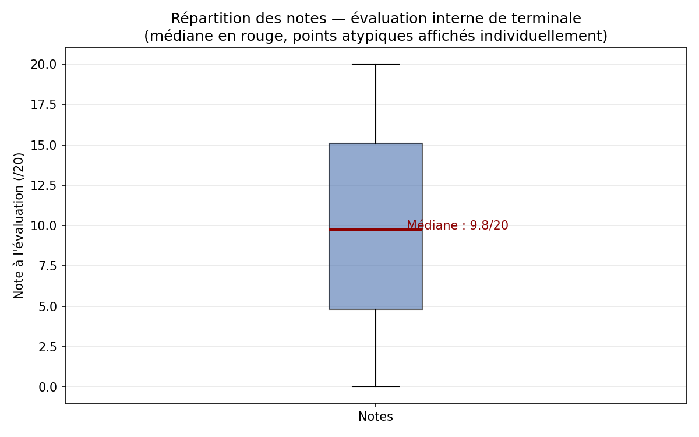
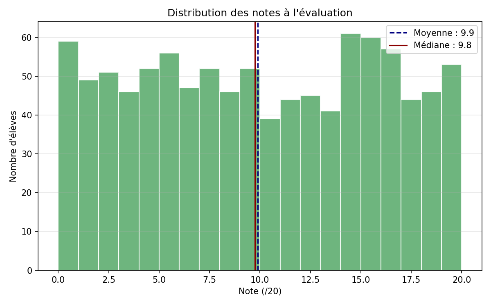

# Rapport — Question 1 : Analyse univariée des notes

**Question du proviseur :**  
*« Comment se répartissent les résultats de mes élèves ? Y a-t-il des élèves dont le note sort vraiment de l'ordinaire ? Comment présenter cela simplement au conseil pédagogique ? »*

**Script :** `src/models/analyse_univariee.py`  
**Notebook :** `notebooks/question1_analyse_univariee.ipynb`

---

## 1. Objectif et méthode

On étudie **une seule variable** : la note à l'évaluation (`Notes`), sans tenir compte de l'assiduité ni de l'orientation.

### Étapes du code

1. **Chargement** — `charger_donnees_brutes()` lit `data/raw/donnees.csv`
2. **Statistiques descriptives** — moyenne, écart-type, quartiles, min/max via `pandas.describe()`
3. **Détection d'outliers** — règle de Tukey : valeurs en dehors de `[Q1 − 1,5×IQR ; Q3 + 1,5×IQR]`
4. **Visualisations** — boîte à moustaches + histogramme

```python
# src/models/analyse_univariee.py — détection Tukey
borne_basse = q1 - 1.5 * iqr
borne_haute = q3 + 1.5 * iqr
outliers = notes[(notes < borne_basse) | (notes > borne_haute)]
```

---

## 2. Résultats numériques

| Statistique | Valeur |
|-------------|--------|
| **Moyenne** | 10,21 /20 |
| **Écart-type** | 5,86 |
| **Q1 (25 %)** | 5,0 |
| **Médiane (Q2)** | 10,6 |
| **Q3 (75 %)** | 15,3 |
| **Minimum** | 0,0 |
| **Maximum** | 20,0 |
| **IQR** | 10,3 |

### Outliers (règle de Tukey)

| Type | Nombre |
|------|--------|
| Outliers bas | **0** |
| Outliers hauts | **0** |

Aucun élève ne dépasse les moustaches de la boîte à moustaches : la distribution est **contenue** sans valeurs extrêmes statistiquement aberrantes, même si des notes de 0 ou 20 existent.

---

## 3. Interprétation pour le conseil pédagogique

### Distribution globale

- La **médiane (10,6)** est proche de la **moyenne (10,21)** → distribution **à peu près symétrique**.
- La moitié des élèves ont une note **inférieure à 10,6** et l'autre moitié au-dessus.
- L'écart-type de **5,86** indique une **dispersion importante** : les notes couvrent bien l'échelle 0–20.

### Présentation simple recommandée

Pour un public non statisticien, privilégier :

1. **La boîte à moustaches** — montre médiane, quartiles et étendue en un graphique
2. **La médiane plutôt que la moyenne** — moins sensible aux valeurs extrêmes
3. **Les quartiles** — « 25 % des élèves sont en dessous de 5/20, 25 % au-dessus de 15,3/20 »

---

## 4. Figures générées

### Boîte à moustaches



- La barre centrale rouge = **médiane**
- La boîte bleue = intervalle interquartile (50 % central des élèves)
- Les moustaches = étendue des notes « normales »

### Histogramme



- Forme **à peu près uniforme** sur [0 ; 20], cohérente avec la génération aléatoire uniforme de X
- Ligne bleue pointillée = moyenne ; ligne rouge = médiane

---

## 5. Fichiers produits

| Fichier | Contenu |
|---------|---------|
| `reports/figures/boxplot_notes_evaluation.png` | Boîte à moustaches |
| `reports/figures/histogramme_notes_evaluation.png` | Histogramme |
| `data/interim/stats_descriptives_notes.csv` | Statistiques exportées |

---

## 6. Réponse synthétique au proviseur

> Les notes se répartissent de façon **relativement uniforme** entre 0 et 20, avec une médiane à **10,6/20**. Aucun élève ne ressort comme statistiquement atypique selon la règle standard (Tukey). Pour le conseil pédagogique, la **boîte à moustaches** est le support le plus lisible : elle montre d'un coup d'œil où se situe la majorité des élèves et la médiane de l'établissement.
