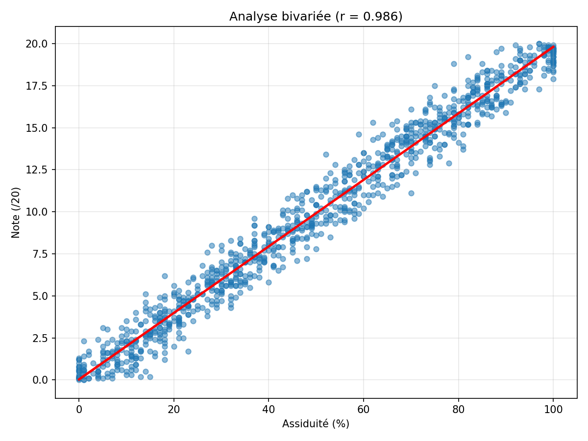
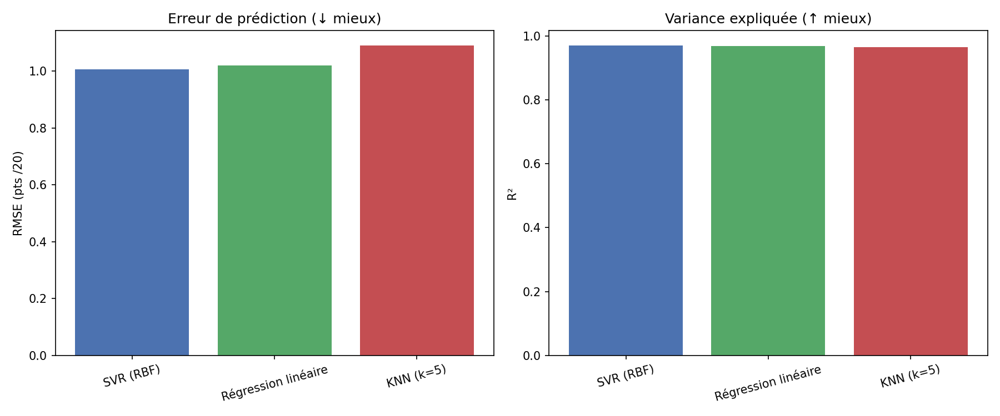
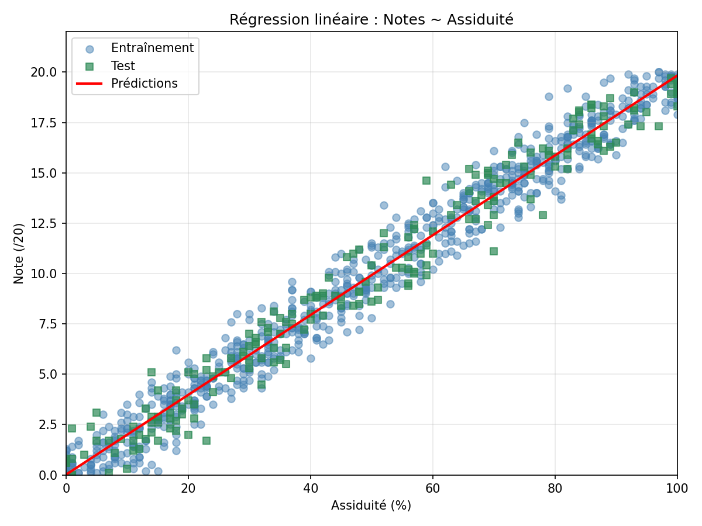

# Rapport — Question 2 : Analyse bivariée et modèles prédictifs

**Question du proviseur :**  
*« Le résultat à l'évaluation est-il lié à l'assiduité ? Peut-on anticiper la note des élèves n'ayant pas encore passé l'évaluation ? À partir de quel point l'anticipation devient-elle trop incertaine ? »*

**Scripts :**
- Volet 1 — `src/models/analyse_bivariate.py`
- Volet 2 — `src/models/comparaison_modeles_q2.py`
- Orchestrateur — `src/models/LinearRegression.py`

**Notebook :** `notebooks/question2_regression_lineaire.ipynb`

---

## 1. Architecture du code (2 volets séparés)

```
Question 2
├── Volet 1 : analyse_bivariate.py     → corrélation, covariance, graphiques
└── Volet 2 : comparaison_modeles_q2.py → 3 modèles, sélection du meilleur
```

Cette séparation permet de **vérifier d'abord le lien** entre les variables avant de construire un modèle prédictif.

---

## 2. Volet 1 — Analyse bivariée

### 2.1 Code expliqué

```python
# src/models/analyse_bivariate.py
pearson  = df["Assiduité"].corr(df["Notes"])           # lien linéaire
spearman = df["Assiduité"].corr(df["Notes"], method="spearman")  # lien monotone
covariance = np.cov(assiduite, notes)[0, 1]            # co-variation
```

| Indicateur | Valeur | Interprétation |
|------------|--------|----------------|
| **Pearson (r)** | **0,987** | Corrélation linéaire très forte |
| **Spearman (ρ)** | **0,986** | Lien monotone très fort (robuste aux outliers) |
| **Covariance** | **170,38** | Les deux variables varient fortement ensemble |

### 2.2 Statistiques descriptives comparées

| Statistique | Notes (/20) | Assiduité (%) |
|-------------|-------------|---------------|
| Moyenne | 10,21 | 51,09 |
| Écart-type | 5,86 | 29,48 |
| Médiane | 10,6 | 53,0 |
| Min / Max | 0 / 20 | 0 / 100 |

### 2.3 Conclusion volet 1

> **Le lien est confirmé** : r = 0,987. L'assiduité est un excellent indicateur linéaire de la note dans ces données. Une modélisation prédictive est pertinente.

### 2.4 Figures volet 1

| Figure | Fichier | Lecture |
|--------|---------|---------|
| Heatmap | `figures/heatmap_correlation_bivariee.png` | r = 0,987 entre Notes et Assiduité |
| Nuage de points | `figures/nuage_points_assiduite_notes.png` | Points alignés sur une droite croissante |
| Jointplot | `figures/jointplot_assiduite_notes.png` | Relation centrale + distributions marginales |



---

## 3. Volet 2 — Comparaison de 3 modèles prédictifs

### 3.1 Objectif

Prédire **Notes** à partir de **Assiduité** pour les élèves n'ayant pas encore passé l'évaluation.

### 3.2 Modèles testés

| Modèle | Principe | Fichier sklearn |
|--------|----------|-----------------|
| **Régression linéaire** | `Notes = a × Assiduité + b` | `LinearRegression` |
| **KNN (k=5)** | Note = moyenne des 5 élèves aux assiduités les plus proches | `KNeighborsRegressor` |
| **SVR (RBF)** | Frontière flexible par noyau radial | `SVR` |

```python
# src/models/comparaison_modeles_q2.py
X_train, X_test, y_train, y_test = train_test_split(X, y, test_size=0.2, random_state=42)
# 800 élèves entraînement / 200 élèves test
```

KNN et SVR utilisent un `StandardScaler` car ils sont sensibles à l'échelle des variables.

### 3.3 Résultats comparatifs (jeu de test, n=200)

| Rang | Modèle | RMSE (pts) | MAE (pts) | R² |
|------|--------|------------|-----------|-----|
| **1** | **SVR (RBF)** | **0,954** | 0,753 | **0,974** |
| 2 | Régression linéaire | 0,961 | 0,765 | 0,973 |
| 3 | KNN (k=5) | 1,039 | 0,817 | 0,969 |

**Modèle retenu : SVR (RBF)** — plus faible erreur de prédiction sur le jeu de test.



### 3.4 Lecture des métriques

| Métrique | Signification | Valeur (SVR) |
|----------|---------------|--------------|
| **RMSE** | Erreur moyenne en points (/20) | **0,95 pt** |
| **MAE** | Erreur absolue moyenne | 0,75 pt |
| **R²** | Part de variance expliquée | **97,4 %** |

### 3.5 Régression linéaire — équation de référence

Même si le SVR l'emporte légèrement, la régression linéaire reste la plus **interprétable** :

```
Notes ≈ 0,20 × Assiduité + 0,05
```

Interprétation : +10 points d'assiduité → environ +2 points de note.

Le rapport statsmodels (`rapport_ols()`) fournit les **intervalles de confiance** sur les coefficients.



---

## 4. Seuil d'incertitude acceptable

**Question :** *« À partir de quel point l'anticipation devient-elle trop incertaine ? »*

**Critère retenu :** RMSE > **2 points** (/20), soit 10 % de la note maximale.

| Situation | RMSE | Décision |
|-----------|------|----------|
| **Nos données** | **0,95 pt** | Anticipation **utilisable avec prudence** |
| Seuil limite | 2,0 pt | Au-delà → ne pas fonder une décision seule |

> Le modèle se trompe en moyenne de **moins d'1 point** sur 20. C'est suffisant pour une **estimation indicative**, mais jamais pour remplacer l'évaluation réelle ou un entretien pédagogique.

---

## 5. Fichiers produits

| Fichier | Contenu |
|---------|---------|
| `data/interim/stats_bivariees.csv` | Stats descriptives Notes + Assiduité |
| `data/interim/matrice_correlation.csv` | Matrice de corrélation |
| `data/interim/comparaison_modeles_q2.csv` | Tableau comparatif des 3 modèles |
| `figures/heatmap_correlation_bivariee.png` | Heatmap |
| `figures/nuage_points_assiduite_notes.png` | Nuage de points |
| `figures/jointplot_assiduite_notes.png` | Jointplot |
| `figures/comparaison_trois_modeles_q2.png` | Barres RMSE / R² |
| `figures/regression_meilleur_modele_q2.png` | Courbe du meilleur modèle |

---

## 6. Réponse synthétique au proviseur

> **Oui, le lien est vérifié** (r = 0,987). On peut estimer la note probable à partir de l'assiduité avec une erreur moyenne d'environ **1 point sur 20**. Tant que l'erreur reste **inférieure à 2 points**, l'anticipation peut guider un entretien ; au-delà, elle ne doit pas fonder une décision seule. Toujours croiser avec les contrôles continus et l'avis des professeurs.
