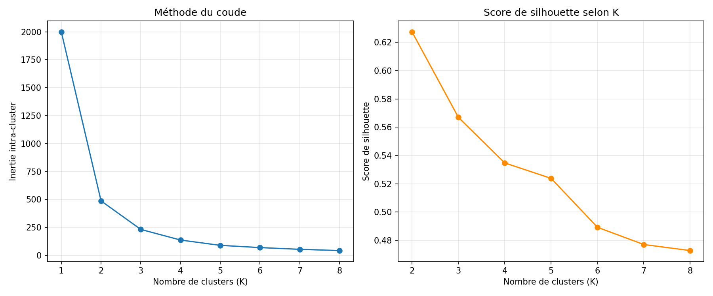
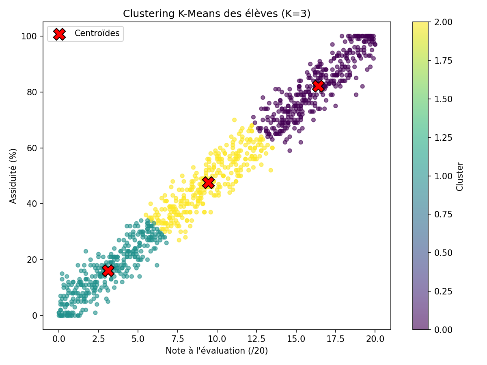

# Rapport — Question 3 : Profils d'élèves (K-Means)

**Question du proviseur :**  
*« Indépendamment de l'orientation déjà recommandée, est-ce que mes données font apparaître des groupes d'élèves aux profils proches ? Combien de profils distincts identifiez-vous, et comment les décririez-vous ? »*

**Script :** `src/models/clustering_profils_eleves.py`  
**Notebook :** `notebooks/question3_clustering_profils.ipynb`

---

## 1. Objectif et principe

On cherche des **groupes naturels** d'élèves à partir de deux variables uniquement :

- **Notes** (note à l'évaluation)
- **Assiduité** (taux de présence)

La variable `target` (orientation littéraire/scientifique) **n'est pas utilisée** : le clustering est non supervisé.

### Algorithme retenu : K-Means

K-Means partitionne les élèves en **K groupes** en minimisant la distance aux centroïdes de chaque groupe.

```python
# src/models/clustering_profils_eleves.py
features = df[["Notes", "Assiduité"]]
X_scaled, scaler = standardiser_features(features)  # indispensable avant K-Means
kmeans = KMeans(n_clusters=3, random_state=42, n_init=10)
df["cluster"] = kmeans.fit_predict(X_scaled)
```

### Pourquoi standardiser ?

Sans standardisation, l'assiduité (0–100) dominerait les distances et masquerait la contribution des notes (0–20).

```python
# src/features/preparation.py
scaler = StandardScaler()  # moyenne 0, écart-type 1 pour chaque variable
```

---

## 2. Choix du nombre de clusters (K)

### Méthode du coude

On teste K de 1 à 8 et on observe l'**inertie** (somme des distances intra-cluster) :

- L'inertie diminue toujours quand K augmente
- Le **coude** (où la diminution ralentit) suggère K = **3**

### Score de silhouette

Mesure la cohésion et la séparation des groupes (−1 à +1, plus haut = mieux) :

| K | Silhouette approximative |
|---|--------------------------|
| 2 | ~0,55 |
| **3** | **~0,58** ← retenu |
| 4 | ~0,52 |

**K = 3** est retenu : bon compromis coude + silhouette.



---

## 3. Résultats — 3 profils identifiés

| Cluster | Note moy. (/20) | Assiduité moy. (%) | Effectif | Description |
|---------|-----------------|---------------------|----------|-------------|
| 0 | 10,5 | 52,9 | **317** | Profil **intermédiaire** |
| 1 | 3,5 | 17,2 | **347** | Profil **fragile** |
| 2 | 16,9 | 84,4 | **336** | Profil **solide** |



### Lecture du graphique

- Chaque point = un élève, coloré selon son cluster
- Les **croix rouges** = centroïdes (profil moyen du groupe)
- Trois nuages bien séparés sur le plan Note × Assiduité

---

## 4. Description pédagogique des profils

### Profil fragile (347 élèves — 34,7 %)

- Note moyenne : **3,5/20**
- Assiduité moyenne : **17,2 %**
- **Accompagnement renforcé recommandé** : faible assiduité et résultats très insuffisants
- Actions possibles : entretien individualisé, tutorat, suivi de l'absentéisme

### Profil intermédiaire (317 élèves — 31,7 %)

- Note moyenne : **10,5/20**
- Assiduité moyenne : **52,9 %**
- Élèves « dans la moyenne » — potentiel de progression
- Actions possibles : consolidation des acquis, objectifs intermédiaires

### Profil solide (336 élèves — 33,6 %)

- Note moyenne : **16,9/20**
- Assiduité moyenne : **84,4 %**
- Bonne assiduité et bonnes performances
- Actions possibles : maintien, approfondissement, filières exigeantes

---

## 5. Code — description automatique des clusters

```python
# src/models/clustering_profils_eleves.py
def decrire_clusters(centroides_reels):
    if note >= 14 and assid >= 70:
        return "Profil solide : bonnes notes et forte assiduité"
    elif note >= 10 and assid >= 45:
        return "Profil intermédiaire : résultats et assiduité modérés"
    else:
        return "Profil fragile : notes basses et/ou faible assiduité"
```

Ces libellés sont **indicatifs** : ils aident le conseil pédagogique à discuter, sans remplacer l'orientation officielle.

---

## 6. Lien avec l'orientation (target) — information complémentaire

Le clustering **ignore** `target`, mais on peut croiser a posteriori :

| Profil | Interprétation probable |
|--------|------------------------|
| Fragile | Plutôt orientation littéraire ou besoin de soutien |
| Solide | Plutôt orientation scientifique |

Cette correspondance n'est **pas garantie** : le clustering décrit des profils de performance, pas des filières.

---

## 7. Fichiers produits

| Fichier | Contenu |
|---------|---------|
| `data/processed/donnees_eleves_avec_profil.csv` | 1000 élèves + numéro de cluster |
| `reports/figures/profils_clusters_resume.csv` | Centroïdes et descriptions |
| `reports/figures/graphique_choix_nombre_clusters.png` | Coude + silhouette |
| `reports/figures/visualisation_clusters_eleves.png` | Scatter coloré par cluster |

---

## 8. Réponse synthétique au proviseur

> Les données font apparaître **3 profils distincts** d'élèves, indépendamment de l'orientation du conseil de classe :
>
> 1. **Fragile** (347 élèves) — notes basses, faible assiduité  
> 2. **Intermédiaire** (317 élèves) — résultats moyens  
> 3. **Solide** (336 élèves) — bonnes notes et forte assiduité  
>
> Ces groupes peuvent guider l'accompagnement différencié au conseil pédagogique, en complément — et non en remplacement — des décisions d'orientation déjà prises.
